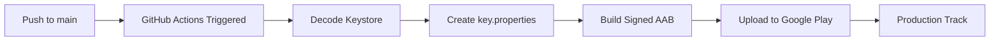

# 🚀 Automatic Android Deployment Guide

This guide will help you set up automatic Android app deployment to Google Play using GitHub Actions.

## ✅ What's Already Set Up

1. **GitHub Actions Workflow** (`.github/workflows/android-release.yml`)

   - Automatically triggers on push to `main` branch
   - Builds production-signed AAB
   - Uploads to Google Play production track

2. **Build Configuration** (`android/app/build.gradle.kts`)

   - Smart signing config (uses keystore if available, fallback to debug)
   - Multi-flavor support (dev, staging, prod)

3. **Security** (`.gitignore`)
   - Keystore files excluded from git
   - key.properties excluded from git

## 🔧 Setup Steps

### Step 1: Add GitHub Secrets

Go to your GitHub repository:
**Settings → Secrets and variables → Actions → New repository secret**

Add these 5 secrets (see [SECRETS_SETUP.md](./SECRETS_SETUP.md) for details):

| Secret Name                        | Description                          | Example                          |
| ---------------------------------- | ------------------------------------ | -------------------------------- |
| `KEYSTORE_BASE64`                  | Your keystore file encoded in base64 | `MIIKyAIBAz...`                  |
| `KEYSTORE_PASSWORD`                | Keystore password                    | `myStorePass123`                 |
| `KEY_PASSWORD`                     | Key password                         | `myKeyPass456`                   |
| `KEY_ALIAS`                        | Key alias                            | `upload`                         |
| `GOOGLE_PLAY_SERVICE_ACCOUNT_JSON` | Google Play service account JSON     | `{"type":"service_account",...}` |

### Step 2: Create/Upload Your Keystore

**Option A: Use existing keystore**

```bash
# Encode your existing keystore
base64 -i android/app/upload-keystore.jks | tr -d '\n'
# Copy output to KEYSTORE_BASE64 secret
```

**Option B: Generate new keystore**

```bash
keytool -genkey -v -keystore android/app/upload-keystore.jks \
  -keyalg RSA -keysize 2048 -validity 10000 \
  -alias upload
# Then encode to base64 and add to secrets
```

### Step 3: Set Up Google Play Service Account

1. Go to [Google Play Console](https://play.google.com/console)
2. Navigate to **Setup → API access**
3. Create service account with these permissions:
   - ✅ Release apps to production
   - ✅ Manage production releases
4. Download JSON key
5. Copy entire JSON content to `GOOGLE_PLAY_SERVICE_ACCOUNT_JSON` secret

### Step 4: Test the Workflow

1. **Make a commit and push to main:**

   ```bash
   git add .
   git commit -m "Set up automatic deployment"
   git push origin main
   ```

2. **Watch the workflow:**

   - Go to **Actions** tab in GitHub
   - Click on "Android Release Build"
   - Monitor the progress

3. **Check Google Play Console:**
   - After successful build, check your app in Google Play Console
   - The AAB should appear in the production track

## 🎯 How It Works



1. **Push to main branch** triggers the workflow
2. **Decode keystore** from base64 secret
3. **Generate key.properties** from secrets
4. **Build** production-signed AAB
5. **Upload** to Google Play production track
6. **Complete** - app is live!

## 📝 Important Notes

### Version Management

Before each release, update the version in `android/app/build.gradle.kts`:

```kotlin
versionCode = 128  // Must be higher than current production
versionName = "1.4.13"  // Semantic version
```

### Track Options

You can change the deployment track in the workflow:

```yaml
track: production # production, beta, alpha, or internal
```

### Manual Deployment

If you need to deploy manually:

```bash
# Build AAB
flutter build appbundle --release

# AAB will be at:
# build/app/outputs/bundle/release/app-release.aab

# Upload manually to Google Play Console
```

## 🐛 Troubleshooting

### Build fails with "null cannot be cast to String"

- ✅ Fixed! The build.gradle.kts now handles missing keystore gracefully

### Keystore decode fails

```bash
# Verify your base64 encoding has no newlines
echo "$KEYSTORE_BASE64" | base64 --decode > test.jks
file test.jks  # Should say "Java KeyStore"
```

### Google Play upload fails

- Check service account permissions
- Verify package name: `com.pixeloid.eventapp`
- Ensure version code is incremented

### "Version code has already been used"

- Increment `versionCode` in `build.gradle.kts`

## 🔐 Security Checklist

- ✅ Keystore files in `.gitignore`
- ✅ key.properties in `.gitignore`
- ✅ All secrets stored in GitHub Secrets (encrypted)
- ✅ Service account has minimal required permissions
- ✅ Workflow never commits sensitive data

## 📞 Support

- GitHub Actions logs: Check the Actions tab
- Google Play Console: [play.google.com/console](https://play.google.com/console)
- Flutter documentation: [docs.flutter.dev](https://docs.flutter.dev)

---

**Ready to deploy?** Follow the steps above and push to main! 🚀
